# 🍽️ Sahara Mess Management System

A comprehensive Django-based mess management system with QR code scanning, Telegram bot integration, and admin panel for hostel/mess operations.

## 🚀 What We Built

### **Core Functionalities**

#### 1. **Student Management System**
- **Registration**: Students register via Telegram bot with personal details
- **Approval Workflow**: Admin approval/denial of new registrations
- **QR Code Generation**: Unique QR codes for each approved student
- **Status Tracking**: Pending, Approved, Denied student statuses

#### 2. **QR Code Scanning System**
- **Access Control**: QR code scanning for mess entry/exit
- **Real-time Validation**: Instant verification of student access rights
- **Scan Event Logging**: Complete audit trail of all scan activities
- **Offline Support**: Works without internet connection

#### 3. **Telegram Bot Integration**
- **Student Interface**: Registration, QR code access, mess cuts, payment uploads
- **Admin Interface**: Approve registrations, verify payments, view reports
- **Notifications**: Real-time updates for approvals, payments, etc.
- **Multi-language Support**: English and Hindi

#### 4. **Payment Management**
- **Upload System**: Students upload payment screenshots via Telegram
- **Verification Workflow**: Admin verification/denial of payments
- **Status Tracking**: None, Uploaded, Verified, Denied payment statuses
- **Payment History**: Complete payment audit trail

#### 5. **Mess Cut (Leave) Management**
- **Leave Requests**: Students can apply for mess cuts via Telegram
- **Date Range Selection**: Flexible from/to date selection
- **Cutoff Rules**: Configurable cutoff times for mess cuts
- **Automatic Processing**: System handles mess cut calculations

#### 6. **Admin Panel**
- **Django Admin**: Full CRUD operations for all models
- **Custom Admin Views**: Specialized interfaces for common operations
- **Bulk Operations**: Mass approve/deny, bulk QR generation
- **Reporting**: Student statistics, payment reports, scan analytics

#### 7. **Background Services**
- **Celery Workers**: Asynchronous task processing
- **Telegram Bot Service**: 24/7 bot operation
- **Data Cleanup**: Automated old data cleanup
- **Backup Services**: Scheduled data backups

## 🛠️ How to Use

### **For Students:**

1. **Registration**:
   - Message the Telegram bot: `/start`
   - Follow registration prompts (name, roll number, room, phone)
   - Wait for admin approval

2. **Access QR Code**:
   - After approval, use `/start` → "Show QR Code"
   - Present QR code at mess scanner

3. **Apply Mess Cut**:
   - Use `/start` → "Apply Mess Cut"
   - Select from/to dates
   - Submit application

4. **Upload Payment**:
   - Use `/start` → "Upload Payment"
   - Send payment screenshot
   - Wait for admin verification

### **For Admins:**

1. **Telegram Admin Panel**:
   - Use `/start` as admin
   - Review pending registrations
   - Verify payment uploads
   - View system reports

2. **Django Admin Panel**:
   - Access `/admin/` on web interface
   - Manage students, payments, mess cuts
   - Generate bulk QR codes
   - View detailed analytics

3. **Scanner Interface**:
   - Access `/scanner/` for QR code scanning
   - Real-time scan validation
   - Offline mode support

### **Management Commands:**

```bash
# Setup initial data and superuser
python manage.py setup_initial_data

# Generate QR codes for all students
python manage.py generate_qr_codes

# Run Telegram bot
python manage.py run_telegram_bot --polling

# Backup system data
python manage.py backup_data

# Cleanup old data
python manage.py cleanup_old_data --dry-run
```

## 🏗️ Architecture


## 📋 Prerequisites

- Python 3.11+
- PostgreSQL 13+
- Redis 6+
- Docker & Docker Compose (optional)
- Telegram Bot Token
- Cloudinary Account
- Google Sheets API Credentials

## 🛠️ Installation

### Using Docker (Recommended)

1. **Clone the repository**
   ```bash
   git clone https://github.com/yourusername/mess-management-system.git
   cd mess-management-system
   ```

2. **Copy environment variables**
   ```bash
   cp .env.example .env
   ```

3. **Configure environment variables**
   Edit `.env` file with your credentials:
   ```bash
   # Required configurations
   TELEGRAM_BOT_TOKEN=your_bot_token
   ADMIN_TG_IDS=your_telegram_id
   CLOUDINARY_URL=your_cloudinary_url
   SHEETS_CREDENTIALS_JSON=your_service_account_json
   QR_SECRET=your_secret_key
   ```

4. **Start the services**
   ```bash
   docker-compose up -d
   ```

5. **Run initial setup**
   ```bash
   docker-compose exec web python manage.py migrate
   docker-compose exec web python manage.py createsuperuser
   docker-compose exec web python manage.py collectstatic --noinput
   ```

### Manual Installation

1. **Install dependencies**
   ```bash
   pip install -r requirements.txt
   ```

2. **Configure PostgreSQL and Redis**
   ```bash
   # Create database
   createdb mess_management
   
   # Start Redis
   redis-server
   ```

3. **Run migrations**
   ```bash
   python manage.py migrate
   python manage.py createsuperuser
   ```

4. **Start services**
   ```bash
   # Terminal 1: Web server
   python manage.py runserver
   
   # Terminal 2: Celery worker
   celery -A mess_management worker --loglevel=info
   
   # Terminal 3: Celery beat
   celery -A mess_management beat --loglevel=info
   
   # Terminal 4: Telegram bot
   python manage.py run_telegram_bot --polling
   ```

## ⚙️ Configuration

### Telegram Bot Setup

1. Create a bot with [@BotFather](https://t.me/botfather)
2. Get your bot token
3. Set webhook URL (production) or use polling (development)
4. Add your Telegram ID to `ADMIN_TG_IDS`

### Google Sheets Setup

1. Create a Google Cloud Project
2. Enable Google Sheets API
3. Create a service account and download credentials
4. Create a spreadsheet and share it with the service account email
5. Add the spreadsheet ID to environment variables

### QR Scanner Access

1. Visit `/scanner/login` 
2. Enter admin password
3. Generate staff tokens with appropriate validity
4. Share scanner URLs with staff

## 📱 Usage

### Student Registration Flow

```mermaid
sequenceDiagram
    participant S as Student
    participant B as Bot
    participant A as Admin
    
    S->>B: /start → Register
    B->>A: New registration notification
    A->>B: Approve/Deny
    B->>S: Approval + QR Code
```



### Payment Upload Flow


### Meal Access Flow


## 🔒 Security Features

- **HMAC-signed QR codes** with versioning support
- **Staff token authentication** with expiration
- **Admin role-based access** via Telegram ID verification
- **Input validation** at all API endpoints
- **Audit logging** for all critical operations
- **Rate limiting** and DDoS protection ready

## 📊 Business Rules

### Mess Cut Rules
- Can only apply for **tomorrow onwards** until **11:00 PM today**
- No same-day or backdated cuts allowed
- Automatic overlap handling with mess closures

### Payment Validation
- Screenshot upload to Cloudinary
- Admin manual verification required
- Cycle-based validity checking
- Offline manual payment marking

### Access Control
- Student must be **approved**
- Valid payment for current cycle required
- No active mess cut for the day
- Mess not closed for the day

## 🔧 API Endpoints

### Public Endpoints
- `POST /api/v1/scanner/scan` - QR code scanning
- `POST /telegram/webhook` - Telegram webhook

### Admin Endpoints
- `GET /api/v1/students/` - List students
- `POST /api/v1/students/{id}/approve` - Approve student
- `GET /api/v1/payments/` - List payments
- `POST /api/v1/payments/{id}/verify` - Verify payment
- `POST /api/v1/admin/qr/regenerate-all` - Regenerate QR codes

### Reports
- `GET /api/v1/admin/reports/payments` - Payment reports
- `GET /api/v1/admin/reports/mess-cuts` - Mess cut reports

## 🧪 Testing

```bash
# Run tests
python manage.py test

# Run with coverage
coverage run --source='.' manage.py test
coverage report

# Load test data
python manage.py loaddata fixtures/test_data.json
```

## 📦 Deployment

### Production Checklist

- [ ] Set `DEBUG=False`
- [ ] Configure HTTPS and SSL certificates
- [ ] Set up proper database with connection pooling
- [ ] Configure Redis for production
- [ ] Set up monitoring (Sentry, logging)
- [ ] Configure backup strategy
- [ ] Set up domain and DNS
- [ ] Configure Telegram webhook
- [ ] Test all functionality end-to-end

### Environment Variables for Production

```bash
DEBUG=False
ALLOWED_HOSTS=yourdomain.com
DATABASE_URL=postgresql://user:pass@db:5432/mess_management
REDIS_URL=redis://redis:6379/0
TELEGRAM_WEBHOOK_URL=https://yourdomain.com/telegram/webhook
SECURE_SSL_REDIRECT=True
```

## 📈 Monitoring

### Health Checks
- `/api/v1/health/` - Application health
- Database connectivity
- Redis connectivity
- Telegram bot status

### Metrics
- Registration approval rate
- Payment verification time
- Scan success rate
- Meal utilization statistics

## 🔄 Backup & Recovery

### Automated Backups
- **Google Sheets**: Real-time backup of critical events
- **Database**: Daily PostgreSQL dumps
- **Media Files**: Cloudinary automatic backup

### DLQ (Dead Letter Queue)
- Failed Google Sheets operations are queued for retry
- Automatic retry with exponential backoff
- Manual recovery tools available

## 🆘 Troubleshooting

### Common Issues

**Bot not responding**
```bash
# Check bot status
docker-compose logs telegram-bot
```

**QR codes not working**
```bash
# Regenerate all QR codes
curl -X POST http://localhost:8000/api/v1/admin/qr/regenerate-all
```

**Payment upload fails**
- Check Cloudinary configuration
- Verify file size limits
- Check network connectivity

### Logs
```bash
# View application logs
docker-compose logs web

# View worker logs  
docker-compose logs worker

# View all logs
docker-compose logs -f
```

## 🤝 Contributing

1. Fork the repository
2. Create a feature branch
3. Make your changes
4. Add tests for new functionality
5. Run the test suite
6. Submit a pull request

## 📄 License

This project is licensed under the MIT License - see the [LICENSE](LICENSE) file for details.

## 🙏 Acknowledgments

- Django REST Framework team
- python-telegram-bot library
- QR Scanner JavaScript library
- All contributors and testers

## 📞 Support

For support and questions:
- Create an issue on GitHub
- Contact the development team
- Check the documentation wiki

---

**Built with ❤️ for efficient mess management**